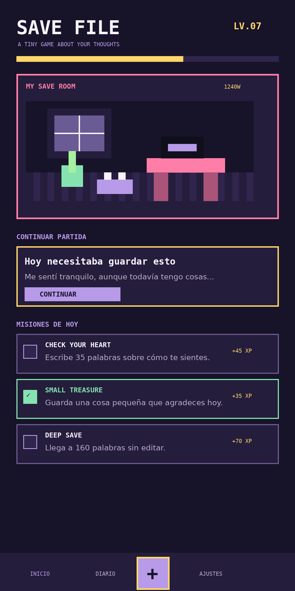

# SAVE FILE Android



**SAVE FILE** es un bloc de notas y diario personal gamificado. Cada entrada funciona como un archivo de guardado, escribir concede experiencia, las misiones diarias proponen pequeñas consignas y una habitación pixel art crece conforme se acumulan recuerdos.

## Versión

- Versión: `1.0.0`
- Código de versión: `1`
- Paquete: `com.entrecheckpoints.savefile`
- Android mínimo: 8.0, API 26
- Objetivo: Android 15, API 35

## Funciones incluidas

### Bloc de notas

- Crear, editar y borrar entradas.
- Título automático cuando se deja vacío.
- Estado de ánimo por entrada.
- Conteo de palabras.
- Notas guardadas localmente mediante Room.
- Visualización como slots de guardado.

### Escritura satisfactoria

- Sonido corto al escribir.
- Campanilla al cerrar una oración.
- Sonido de guardado y de subida de nivel.
- Vibración suave opcional.
- Último carácter animado dentro del editor.
- Palabras emocionales resaltadas con colores del tema mientras se escribe.
- Medidor de combo según la cantidad de palabras.
- Cartel animado de `PROGRESO GUARDADO`.

Todos los sonidos fueron creados específicamente para el proyecto y están almacenados dentro de la aplicación.

### Progreso

- Experiencia por guardar entradas.
- Niveles calculados a partir de XP.
- Tres misiones diarias deterministas.
- XP adicional por completar misiones.
- Habitación pixel art que desbloquea elementos con el progreso.
- Temas visuales desbloqueables por nivel.

### Temas

- Lavender Dream, disponible desde el inicio.
- Mint Cartridge, nivel 3.
- Sunset CRT, nivel 5.
- Midnight Save, nivel 8.

### Privacidad

- Sin cuentas.
- Sin anuncios.
- Sin analítica.
- Sin conexión obligatoria.
- Notas y progreso guardados en el dispositivo.
- Compatible con las copias de seguridad y transferencia local de Android.

## Compilar con GitHub Actions

1. Sube el contenido de este proyecto a la raíz de un repositorio.
2. Abre **Actions → Build SAVE FILE APK**.
3. Pulsa **Run workflow** o realiza un commit en `main`.
4. Descarga el artefacto `save-file-android-v1.0.0-debug`.
5. Extrae `app-debug.apk`.

La firma debug incluida es fija para que futuras compilaciones puedan instalarse encima de la versión anterior. Es pública y no debe utilizarse para publicar en Google Play.

## Publicar en GitHub Releases

Abre **Actions → Publicar SAVE FILE APK**, ejecuta el workflow y utiliza el tag `v1.0.0`. El release incluirá:

- `SaveFile.apk`
- `SaveFile.apk.sha256`

## Compilar localmente

Requisitos:

- JDK 17.
- Android SDK Platform 35.
- Android SDK Build Tools 35.0.0.

Linux o macOS:

```bash
./scripts/build-apk.sh
```

Windows:

```bat
scripts\build-apk.bat
```

## Estructura técnica

- Kotlin.
- Jetpack Compose.
- Room.
- SharedPreferences con StateFlow.
- SoundPool.
- Canvas para la habitación pixel art.
- Arquitectura local sin backend.

## Límites de la versión 1.0.0

- No incluye bloqueo con PIN o biometría todavía.
- No exporta notas a PDF, TXT o JSON todavía.
- Las misiones se evalúan con reglas locales simples, no mediante análisis emocional.
- Las animaciones de escritura están diseñadas para ser suaves, pero el rendimiento final depende del dispositivo.
